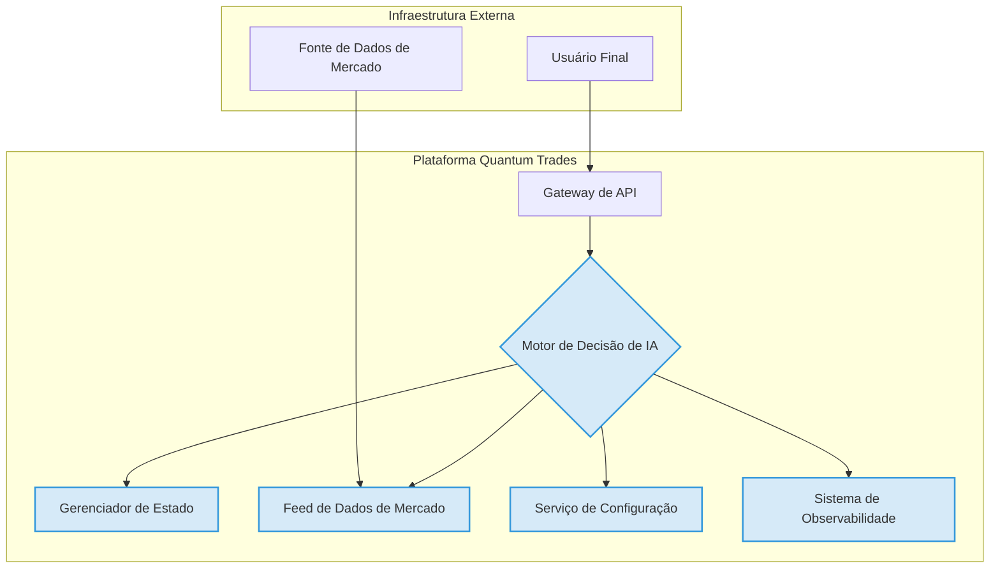
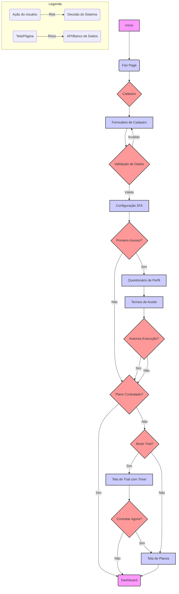

# Manual Mestre Quantum Trades

**Versão:** 3.0 - Final  
**Data:** 05 de Janeiro de 2026  
**Autor:** Manus AI

---

## Introdução

Este documento representa o Manual Mestre da Quantum Trades, consolidando todas as diretrizes, especificações e estratégias da empresa em um único guia de referência. Ele foi projetado para servir como a fonte central da verdade para todas as equipes, desde o desenvolvimento e produto até o marketing e a governança, garantindo alinhamento, consistência e excelência operacional.

O manual está dividido em cinco frentes principais:

1.  **Institucional:** A essência da Quantum Trades, nossa missão, visão e propósito.
2.  **Comunicação e Marketing:** As diretrizes que governam nossa marca, identidade visual e interação com o público.
3.  **Regras de Negócio e Governança:** A estrutura legal, ética e de risco que sustenta nossas operações.
4.  **Técnico:** A arquitetura e as especificações que impulsionam nossa plataforma.
5.  **Fluxo da Ferramenta:** A jornada completa do nosso usuário, detalhando a experiência na plataforma.

Este é um documento vivo, destinado a evoluir junto com a Quantum Trades. Ele deve ser consultado como a principal referência para a tomada de decisões e a execução de projetos.

## Parte 1: Institucional

Esta seção define a essência da Quantum Trades, nossa missão, visão, propósito e os objetivos que norteiam nossa plataforma. É a base sobre a qual todos os outros aspectos da empresa são construídos.

### 1.1. Propósito e Missão

O propósito central da Quantum Trades é **democratizar o acesso a estratégias de investimento sofisticadas por meio da inteligência artificial**, capacitando investidores de todos os níveis a operar com a mesma disciplina e análise de dados de grandes instituições financeiras.

Nossa missão é fornecer uma plataforma de trading autônomo que seja:

*   **Confiável:** Construída sobre uma base de governança de risco robusta e transparente.
*   **Inteligente:** Utilizando IA e Machine Learning para analisar o mercado, identificar oportunidades e se adaptar continuamente.
*   **Acessível:** Com uma interface clara e intuitiva que abstrai a complexidade dos algoritmos subjacentes.

> **Filosofia do Fundador:** Acreditamos que a tecnologia pode nivelar o campo de jogo nos mercados financeiros. A Quantum Trades nasceu da convicção de que a disciplina e a análise sistemática, potencializadas pela IA, são as chaves para a consistência a longo prazo, eliminando o viés emocional que tantas vezes prejudica o investidor individual.

### 1.2. O que é a Quantum Trades?

A Quantum Trades é uma plataforma de trading automatizado que utiliza inteligência artificial para analisar o mercado, identificar oportunidades e executar operações 24/7. Funcionamos como uma camada de inteligência entre o investidor e o mercado, oferecendo um **agente de IA financeiro autônomo** que opera como um sistema híbrido de análise, recomendação e automação de investimentos.

O "Cérebro" do nosso sistema consolida informações de diversas fontes, aplica algoritmos de análise técnica, valida dados com sistemas de expiração e aprende com o feedback de suas próprias operações, buscando sempre as estratégias com maior probabilidade de sucesso.

### 1.3. Objetivos Estratégicos

Nossos objetivos são estruturados em fases, refletindo nosso compromisso com um crescimento sustentável e responsável:

1.  **Fundação e Planejamento (Fase 0):** Estabelecer as bases técnicas, legais e estratégicas do projeto.
2.  **Desenvolvimento do MVP (Fase 1):** Construir a funcionalidade central da plataforma em um ambiente de demonstração seguro.
3.  **Validação em Beta Fechado (Fase 2):** Validar a plataforma com usuários reais e testar a execução em ambiente real.
4.  **Lançamento Público e Escala (Fase 3):** Abrir a plataforma ao público, escalar as operações e otimizar a infraestrutura.

---


## Parte 2: Produto e Marketing

Esta seção detalha o público-alvo, os indicadores de sucesso e a estratégia de comunicação da Quantum Trades.

Esta seção estabelece as diretrizes para a identidade visual e a comunicação da Quantum Trades, garantindo uma marca coesa, profissional e impactante em todos os pontos de contato.

### 2.1. Identidade Visual

Nossa identidade visual é projetada para comunicar confiança, performance e clareza.

#### 2.1.1. Logotipo

O logotipo é o principal identificador da marca. O símbolo "Q" com a seta ascendente representa crescimento e avanço tecnológico, enquanto a fonte Montserrat em caixa alta transmite solidez e modernidade.

**Variações:**

*   **Primário (Horizontal):** Usado na landing page, materiais institucionais e apresentações.
*   **Secundário (Símbolo):** Usado como favicon, ícone de app e em cabeçalhos compactos.


#### 2.1.2. Paleta de Cores

A paleta de cores cria uma atmosfera de sofisticação e confiança.

| Cor | Amostra | HEX | Uso |
| :--- | :--- | :--- | :--- |
| **Azul Noturno** | 🔵 | `#0A192F` | Fundo principal de todas as interfaces. |
| **Dourado Quantum** | 🟡 | `#FFD700` | Destaques, CTAs e gráficos importantes. |
| **Verde Positivo** | 🟢 | `#28A745` | Lucros, ganhos e movimentos de alta. |
| **Vermelho Negativo** | 🔴 | `#DC3545` | Perdas, prejuízos e movimentos de baixa. |
| **Cores Neutras** | ⚪ | `#FFFFFF`, `#F8F9FA`, `#6C757D` | Textos, ícones secundários e bordas. |

#### 2.1.3. Tipografia

A fonte principal é a **Montserrat**, escolhida por sua clareza e legibilidade em telas digitais.

*   **Bold (700):** Títulos principais e valores de destaque.
*   **SemiBold (600):** Subtítulos e botões.
*   **Regular (400):** Corpo de texto e informações secundárias.

#### 2.1.4. Estilo de Interface (UI) e Mockups

O estilo da interface é limpo e focado nos dados, utilizando cards com cantos arredondados e gráficos com gradientes suaves. Os mockups abaixo ilustram a aplicação prática da nossa identidade visual.

**Mockups de Referência:**

*   **Apresentação Combinada:** Visão geral da plataforma em desktop e mobile.
    
*   **Website (Landing Page):** A porta de entrada para novos usuários.
    
*   **App Mobile (Portfólio e Operações):** A experiência do usuário em dispositivos móveis.
    
    

#### 2.1.5. Uso Correto da Marca (Faça e Não Faça)

Para manter a consistência, é crucial seguir estas diretrizes:

*   **Faça:** Manter as proporções, garantir o contraste e respeitar a área de respiro.
*   **Não Faça:** Distorcer, alterar as cores, usar em fundos conflitantes ou adicionar efeitos visuais.

### 2.2. Tom de Voz e Comunicação

Nosso tom de voz deve ser **confiante, educacional e profissional**. Evitamos linguagem casual e promessas de ganhos garantidos, focando em performance, risco e tecnologia.

> **Exemplo:** Em vez de "Faça dinheiro fácil com nosso robô!", usamos "Otimize suas operações com nossa IA. Monitore a performance e gerencie seu risco de forma inteligente."

### 2.2. Personas

Nossa estratégia de produto e comunicação é guiada por três personas principais:

| Persona | Perfil | Objetivos | Dores | Como Ajudamos |
| :--- | :--- | :--- | :--- | :--- |
| **Jogador em Transição** | 22-34 anos, acostumado a bets, renda variável. | Transformar "sorte" em algo mais inteligente. | Não entende termos técnicos, medo de golpes. | Interface gamificada, termos simplificados, risco controlado. |
| **Trader Ocupado** | 28-45 anos, já investe, trabalha em horário comercial. | Automatizar estratégias para não ficar 100% na tela. | Falta de tempo, cansaço de configurar robôs complexos. | Bots prontos, dashboards claros, alertas 24/7. |
| **Investidor Cauteloso** | 30-55 anos, foco em preservação de capital. | Testar estratégias com risco controlado. | Medo de volatilidade, desconfiança de "robôs milagrosos". | Simulações, backtests, modos conservadores. |

### 2.3. KPIs do MVP

O sucesso do nosso MVP será medido por um conjunto de indicadores de produto, retenção e percepção.

*   **Produto:** Usuários cadastrados, usuários ativos mensais (MAU), bots por usuário, taxa de ativação.
*   **Retenção:** Retenção D30, sessões semanais por usuário.
*   **Percepção:** NPS/CSAT, tickets de suporte por 100 usuários.

### 2.4. Marketing e Planos

Nossa estratégia de marketing de entrada (Fan Page) foca em um design moderno e impactante, descrevendo as vantagens da plataforma e apresentando os ganhos potenciais de forma transparente.

#### 2.3.1. Planos e Trial

O fluxo de planos é projetado para ser flexível:

1.  **Usuários sem plano:** São direcionados para a tela de contratação.
2.  **Trial:** Oferecemos um período de teste com um timer informativo e a opção de contratar a qualquer momento.
3.  **Usuários com plano:** Acessam diretamente o dashboard.

---


## Parte 3: Regras de Negócio e Governança

Esta seção detalha a estrutura legal, ética e de risco que sustenta as operações da Quantum Trades, garantindo a conformidade e a proteção dos nossos usuários.

### 3.1. Estrutura de Governança

Nossa governança é baseada em papéis claros, rituais consistentes e uma matriz de decisão que elimina ambiguidades.

#### 3.1.1. Papéis e Responsabilidades

| Papel | Responsabilidades Chave |
| :--- | :--- |
| **CEO** | Aprovação final da política de risco e responsável perante investidores e reguladores. |
| **Product Manager (PM)** | Dono do Risco do Produto, monitora o dashboard de risco e lidera a resposta a incidentes. |
| **Head of ML** | Responsável pela validação técnica, performance e explicabilidade dos modelos de IA. |
| **Risk Manager** | Desenvolve a matriz de risco, conduz auditorias e valida a eficácia dos controles. |
| **CTO** | Garante a robustez e segurança da infraestrutura e implementa os "circuit breakers". |
| **Customer Success Lead** | Ponto de contato primário para comunicação com usuários durante incidentes. |

#### 3.1.2. Rituais de Governança

A supervisão contínua é mantida através de rituais com frequências e objetivos claros:

*   **Diário:** Stand-up automatizado para revisar o dashboard de risco.
*   **Semanal:** Reunião tática para discutir alertas, performance dos modelos e feedback de clientes.
*   **Mensal:** Auditoria de risco e compliance para revisar logs e garantir a aderência aos controles.
*   **Trimestral:** Reunião do Product Risk Board (PRB) para revisar a matriz de risco e aprovar mudanças estratégicas.

### 3.2. Gestão de Risco

Para evitar decisões subjetivas em momentos de crise, o sistema possui gatilhos automáticos baseados em métricas objetivas.

#### 3.2.1. Gatilhos Objetivos e Circuit Breakers

| Nível | Gatilho Exemplo | Ação Automática |
| :--- | :--- | :--- |
| **Crítico (Vermelho)** | Drawdown global > 8% em 24h. | **STOP TRADING:** Todas as novas operações de IA são bloqueadas. |
| **Alto (Laranja)** | Drawdown de um único modelo > 15%. | **PAUSAR MODELO:** O modelo específico é colocado em modo "somente fechamento". |
| **Aviso (Amarelo)** | Aumento do churn em 20% na semana. | **Nenhuma ação automática.** Alerta gerado no dashboard de risco para análise. |

#### 3.2.2. Matriz de Riscos Estratégicos

Identificamos e monitoramos continuamente os principais riscos ao nosso negócio, com planos de mitigação claros para cada um. A matriz completa inclui riscos de modelo, execução, regulatório, segurança, mercado, latência, usabilidade, churn, escalabilidade e concentração.

### 3.3. Regras Gerais e Limites

#### 3.3.1. Contrato de Uso e Partes Legais

O fluxo de primeiro acesso do usuário inclui a aceitação explícita dos **Termos de Uso**, da **Política de Privacidade** e da **Política de Risco**. Estes documentos deixam claro que a Quantum Trades é uma ferramenta de apoio, e o usuário final é o responsável por suas decisões de investimento.

#### 3.3.2. Limites da IA: Soberania vs. Flexibilidade

*   **Soberano (Não Flexível):** As regras de gerenciamento de risco (Stop Loss, limites de perda diária) e os gatilhos de circuit breakers são soberanos e não podem ser alterados pelo usuário. A proteção do capital é a diretriz máxima.
*   **Flexível (Configurável):** O usuário pode configurar seu perfil de risco (conservador, moderado, agressivo), selecionar as estratégias (setups) que deseja utilizar e definir o nível de automação (sugestão vs. execução automática).

### 3.4. Roadmap Regulatório

Nossa estratégia regulatória evolui com o produto:

1.  **Ano 1 (Ferramenta Educacional):** A plataforma atua como ferramenta de automação, não requerendo registro como consultor ou gestor.
2.  **Anos 2-3 (Consultoria de IA):** Com a evolução da IA, podemos buscar o enquadramento como consultoria de valores mobiliários.
3.  **Ano 3+ (Gestão de Carteiras):** Em uma fase futura, podemos buscar o registro como gestor de carteiras, assumindo maior responsabilidade fiduciária.

---


## Parte 4: Técnico

Esta seção descreve a arquitetura, os contratos de dados e as especificações técnicas que impulsionam a plataforma Quantum Trades, servindo como um guia para a equipe de desenvolvimento e engenharia.

### 4.1. Arquitetura de Alto Nível

Nossa arquitetura é baseada em um sistema de microsserviços desacoplados, permitindo que cada componente seja desenvolvido, testado e escalado de forma independente. O diagrama abaixo ilustra os principais componentes e suas interações.



| Componente | Descrição |
| :--- | :--- |
| **Gateway de API** | Ponto de entrada único para todas as requisições, responsável por autenticação, autorização, rate limiting e roteamento. |
| **Motor de Decisão de IA** | O núcleo do sistema, que processa a lógica de decisão e retorna uma recomendação de trade estruturada. |
| **Gerenciador de Estado** | Banco de dados de baixa latência (e.g., Redis) que armazena o estado atual das posições e informações voláteis. |
| **Feed de Dados de Mercado** | Serviço responsável por consumir, limpar e fornecer dados de mercado em tempo real e históricos. |
| **Serviço de Configuração** | Armazena parâmetros e regras de negócio de forma externa, permitindo ajustes dinâmicos. |
| **Sistema de Observabilidade** | Coleta e centraliza logs estruturados, métricas de performance e traces distribuídos. |

### 4.2. Contrato de Dados (Schemas)

Utilizamos TypeScript para definir os schemas de dados que formam o contrato entre os serviços. A seguir, os principais enums e interfaces.

#### 4.2.1. Enums Fundamentais

*   `DirecaoTrade`: `COMPRA`, `VENDA`, `NEUTRO`
*   `TipoSetup`: `TREND_FOLLOWING`, `MEAN_REVERSION`, `BREAKOUT`, etc.
*   `PerfilRiscoUsuario`: `CONSERVADOR`, `MODERADO`, `AGRESSIVO`
*   `Timeframe`: `M1`, `M5`, `M15`, `D`, `W`, etc.
*   `OperadorCondicao`: `>`, `<`, `CRUZOU_ACIMA`, `CRUZOU_ABAIXO`, etc.

#### 4.2.2. Estrutura Principal de Saída (`DecisaoTrade`)

A saída do Motor de IA é um objeto JSON padronizado que contém todas as informações da recomendação, garantindo transparência e rastreabilidade.

```json
{
  "ativo": "PETR4",
  "timeframe": "15m",
  "timestamp_analise": "2025-12-28T10:15:00-03:00",
  "decisao": "COMPRA",
  "confianca": 0.73,
  "preco_entrada": 37.25,
  "stop_loss": 36.70,
  "stop_gain": 38.60,
  "risco_por_trade_pct": 0.01,
  "tamanho_posicao": 150,
  "setup_principal": "TREND_PULLBACK_EMA20_RSI",
  "motivo_textual": "Mercado em tendência de alta (EMA20>EMA50, ADX>25). Preço fez pullback até EMA20 com RSI retornando de 38 para 45..."
}
```

### 4.3. Ciclo de Vida da Operação

O motor gerencia o ciclo de vida completo de uma operação:

1.  **Análise Contínua:** A cada novo candle, o motor reavalia o contexto de mercado.
2.  **Decisão de Entrada:** Se não houver posição aberta, o motor executa a lógica de decisão para gerar um sinal de entrada.
3.  **Monitoramento de Posição:** Se uma posição estiver aberta, o motor verifica o atingimento de alvos/stops e condições de saída antecipada.
4.  **Decisão de Saída:** Se uma condição de saída for atendida, o motor gera uma decisão de `NEUTRO` para fechar a posição.

### 4.4. Prompt da IA

O prompt que guia nosso modelo de linguagem (LLM) é refinado para garantir segurança e transparência.

> **Princípios Orientadores:**
> 1.  **Segurança em Primeiro Lugar:** Na dúvida, a decisão correta é `NEUTRO`.
> 2.  **Transparência Total:** O campo `motivoTextual` deve ser um log detalhado do raciocínio.
> 3.  **Siga as Regras Estritamente:** As regras de risco não são sugestões, são ordens.

---

## Parte 5: Fluxo da Ferramenta e Mapa de Telas

Esta seção detalha a jornada completa do usuário e o escopo de telas do nosso MVP.

### 5.1. Mapa de Telas do Produto (MVP)

| Tela / Módulo | Objetivo Principal | Persona Foco | MVP? |
| :--- | :--- | :--- | :--- |
| Landing Page | Explicar proposta, capturar leads/contas | Todas | Sim |
| Cadastro / Login | Criar conta segura e autenticar usuário | Todas | Sim |
| Onboarding Inicial | Explicar em 2-3 passos o que a plataforma faz | Jogador em Transição / Cauteloso | Sim |
| Dashboard Geral | Mostrar saldo, retorno e KPIs principais | Todas | Sim |
| Tela Portfólio | Ver distribuição por classe (RF, ações, etc.) | Trader Ocupado / Cauteloso | Sim |
| Tela Performance | Ver rentabilidade no tempo vs benchmark | Trader Ocupado | Sim |
| Lista de Bots | Listar bots existentes e status | Todas | Sim |
| Criar / Editar Bot | Configurar estratégia básica de automação | Trader Ocupado / Jogador | Sim |
| Operações Recentes | Visualizar histórico resumido de trades | Todas | Sim |
| Tela de Planos / Trial | Gerenciar assinatura, trial e upgrades | Todas | Sim |
| Ajuda / FAQ / Riscos | Explicar riscos, termos e dúvidas comuns | Cauteloso / Reguladores | Sim |

### 5.2. Diagrama de Fluxo do Usuário

Esta seção detalha a jornada completa do usuário na plataforma Quantum Trades, desde o primeiro contato com a marca até a utilização avançada do dashboard. O fluxo foi projetado para ser intuitivo, seguro e educacional.

### 5.1. Diagrama de Fluxo do Usuário

O diagrama abaixo, gerado a partir do mapa mental, ilustra as principais etapas e pontos de decisão na experiência do usuário.



### 5.2. Detalhamento das Etapas

1.  **Fan Page (Marketing):** O primeiro contato do usuário com a Quantum Trades. O design é moderno e focado em comunicar as vantagens e a segurança da plataforma.

2.  **Cadastro (Onboarding):** Um formulário simples solicita dados essenciais (Nome, CPF, E-mail) e a(s) corretora(s) do usuário. A validação de dados é feita em tempo real.

3.  **Configuração de Segurança (2FA):** Após o cadastro, o usuário é guiado a configurar a autenticação de dois fatores (Google Authenticator), um passo obrigatório para garantir a segurança da conta.

4.  **Primeiro Acesso e Perfil de Risco:** No primeiro login, um questionário ajuda a definir o perfil de risco do usuário (conservador, moderado, agressivo) e seus objetivos. Os Termos de Uso e a Política de Risco são apresentados para aceite.

5.  **Planos e Trial:** O usuário pode optar por um plano pago ou iniciar um período de teste (trial). A plataforma oferece um fluxo claro para a contratação, mas permite que o usuário explore o dashboard mesmo no modo trial.

6.  **Dashboard:** O centro de controle do usuário. Aqui ele visualiza seu portfólio, a performance de suas estratégias, as operações recentes e os insights gerados pela IA. A interface é projetada para ser clara e focada nos dados, seguindo os padrões de UX definidos no manual de identidade visual.

### 5.3. Módulos Principais

*   **Dashboard:** Visão geral do portfólio e KPIs.
*   **Bots:** Configuração e monitoramento dos robôs de trading.
*   **Mercado:** Cotações e análises de mercado em tempo real.
*   **Menu:** Configurações de conta, preferências e acesso ao suporte.

---

## Conclusão

Este Manual Mestre representa a consolidação do conhecimento e da estratégia da Quantum Trades. Ele é a nossa bússola, garantindo que todos na empresa remem na mesma direção, com um entendimento claro de nossos objetivos, nossa marca, nossas regras e nossa tecnologia. A adesão a este manual é fundamental para construirmos uma plataforma de excelência e uma marca de confiança no mercado.


## Apêndice A: Plano de Implementação Detalhado

Esta seção fornece o roadmap detalhado para a construção e o lançamento da Quantum Trades, dividido em fases lógicas com tarefas, responsabilidades e prioridades claras.

### Fase 0: Fundação e Planejamento Estratégico

**Objetivo:** Definir as bases críticas do projeto.

| ID | Área Responsável | Tarefa | Prioridade |
| :--- | :--- | :--- | :--- |
| T01 | Tech | Definir a stack tecnológica completa (frontend, backend, DB, infra) | P0 |
| T02 | Jurídico | Validar o escopo regulatório da Fase 1 (ferramenta educacional) | P0 |
| T03 | Marketing | Definir o Perfil de Cliente Ideal (ICP) e a Proposta de Valor | P0 |
| T04 | UX | Criar wireframes de baixa fidelidade para o fluxo de onboarding | P1 |
| T05 | Tech | Configurar o repositório de código e o pipeline de CI/CD inicial | P0 |
| T06 | Marketing | Criar a landing page inicial para captura de leads | P1 |
| T07 | Operacional | Definir os processos de suporte ao cliente para o lançamento | P2 |
| T08 | Segurança | Desenvolver a política de segurança e o modelo de ameaças inicial | P1 |
| T09 | Jurídico | Elaborar a primeira versão dos Termos de Uso e Política de Privacidade | P0 |

### Fase 1: Desenvolvimento do MVP

**Objetivo:** Plataforma funcional com onboarding, dashboard e motor de IA em modo DEMO.

| ID | Área Responsável | Tarefa | Prioridade |
| :--- | :--- | :--- | :--- |
| T10 | Tech | Implementar o serviço de autenticação e gerenciamento de usuários | P0 |
| T11 | UX | Desenvolver o design system e a UI de alta fidelidade para o dashboard | P0 |
| T12 | Tech | Construir o motor de IA v1 (com 2-3 setups básicos) | P0 |
| T13 | Tech | Desenvolver o orquestrador de ordens (modo DEMO) | P0 |
| T14 | Segurança | Implementar a autenticação de dois fatores (2FA) | P0 |
| ... | ... | ... | ... |

### Fase 2: Beta Fechado e Validação

**Objetivo:** Validar a plataforma com usuários reais e testar a execução em ambiente real.

| ID | Área Responsável | Tarefa | Prioridade |
| :--- | :--- | :--- | :--- |
| T36 | Tech | Integrar com a API de uma corretora para execução de ordens reais | P0 |
| T37 | Operacional | Onboarding de um grupo de 10-20 beta testers | P1 |
| T38 | UX | Coletar feedback estruturado dos usuários sobre a experiência | P1 |
| T39 | Tech | Implementar o dashboard de métricas de performance do sistema | P1 |
| ... | ... | ... | ... |

### Fase 3: Lançamento Público e Escala

**Objetivo:** Abrir a plataforma ao público, escalar as operações e otimizar a infraestrutura.

| ID | Área Responsável | Tarefa | Prioridade |
| :--- | :--- | :--- | :--- |
| T53 | Marketing | Lançar a campanha de marketing digital para aquisição de usuários | P1 |
| T54 | Tech | Otimizar a infraestrutura para suportar 1.000 usuários concorrentes | P1 |
| T55 | Governança | Estabelecer formalmente o comitê de governança de IA | P2 |
| ... | ... | ... | ... |


## Apêndice B: Detalhes de Governança e Risco

### Matriz de Riscos Estratégicos

| Risco | Probabilidade | Impacto | Mitigação |
| :--- | :--- | :--- | :--- |
| **Risco de Modelo** | Média | Alto | Backtesting rigoroso, monitoramento contínuo, circuit breakers. |
| **Risco de Execução** | Baixa | Alto | Múltiplas conexões com corretoras, reconciliação de ordens. |
| **Risco Regulatório** | Média | Alto | Roadmap regulatório faseado, acompanhamento jurídico constante. |
| **Risco de Segurança** | Média | Alto | Pentests regulares, 2FA obrigatório, criptografia de dados. |
| **Risco de Mercado** | Alta | Médio | Diversificação de estratégias, limites de drawdown. |

### Checklist de Pré-Produção para Features de IA

1.  [ ] O modelo foi validado em dados out-of-sample?
2.  [ ] Os limites de risco (stop loss, etc.) foram definidos e testados?
3.  [ ] A explicabilidade do modelo (motivo textual) é clara e informativa?
4.  [ ] Os logs gerados são suficientes para auditoria?
5.  [ ] A feature foi testada em ambiente de staging com dados de produção simulados?
6.  [ ] O impacto na performance da plataforma foi medido?
7.  [ ] A documentação técnica foi atualizada?
8.  [ ] A equipe de Customer Success foi treinada sobre a nova feature?
9.  [ ] O plano de rollback foi definido e testado?
10. [ ] A feature foi aprovada pelo Product Risk Board (PRB)?


## Apêndice C: Detalhes Adicionais

### Exemplo de Estrutura de Setup (Técnico)

```typescript
interface Setup {
  id: string;
  nome: string;
  tipo: TipoSetup;
  timeframe: Timeframe;
  condicoesEntrada: Condicao[];
  condicoesSaida: Condicao[];
  parametros: Record<string, any>; // e.g., { media_curta: 20, media_longa: 50 }
}

interface Condicao {
  indicador: string; // e.g., 'EMA', 'RSI'
  operador: OperadorCondicao;
  valor: number | string; // e.g., 30, 'EMA_50'
}
```

### Checklist de Revisão Trimestral (Institucional)

Este checklist, derivado do manual do fundador, deve ser revisado pelo Product Risk Board (PRB) a cada trimestre.

*   **Contexto de Mercado:** As estratégias atuais ainda são adequadas para o cenário macroeconômico?
*   **Conceitos-Chave:** Nossos modelos de IA estão capturando as dinâmicas de mercado relevantes?
*   **Governança:** Os rituais e papéis estão sendo seguidos e são eficazes?
*   **Riscos:** A matriz de risco está atualizada? Novos riscos emergiram?
*   **Estratégia Regulatória:** Estamos no caminho certo em nosso roadmap regulatório?

